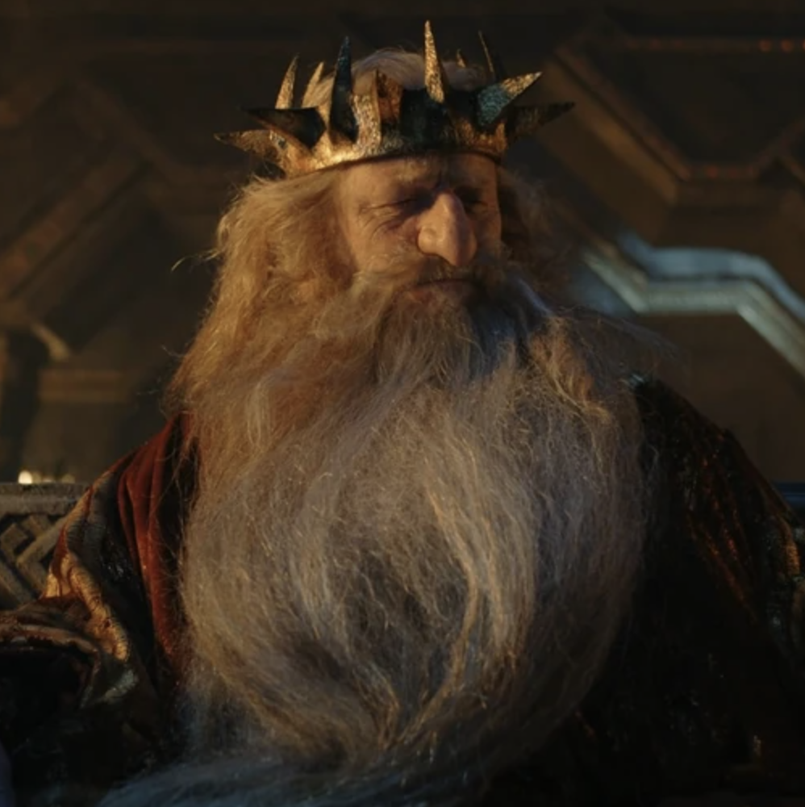
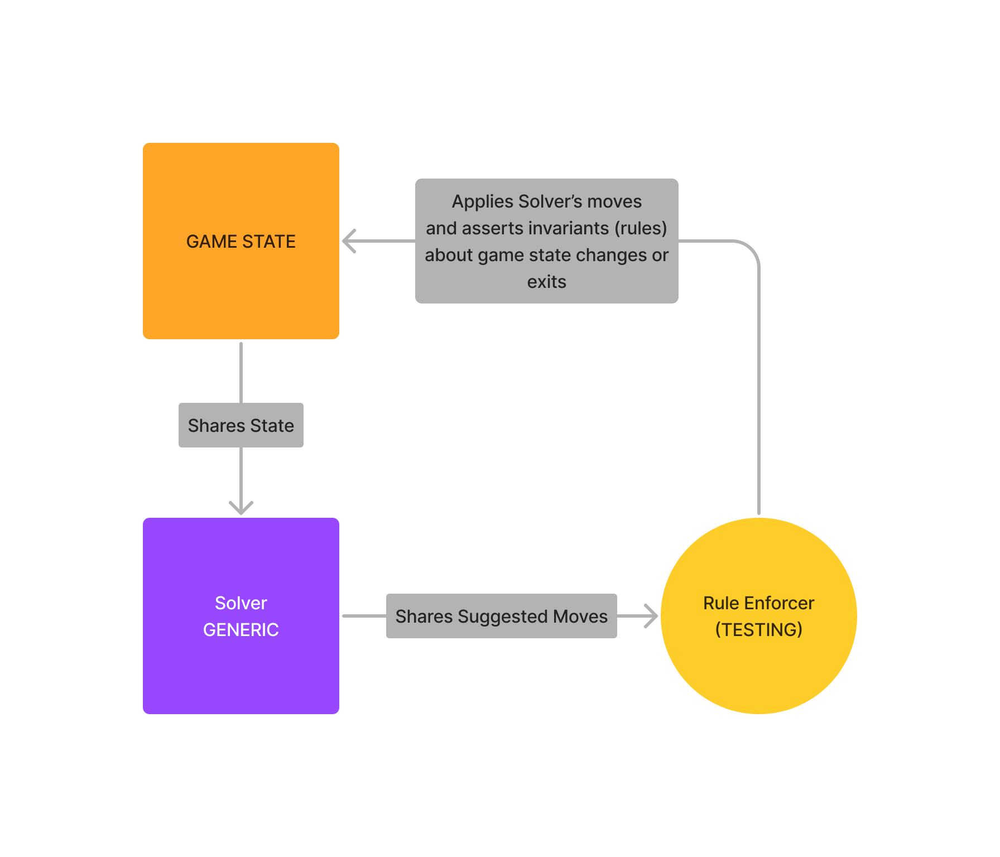

# `durin` •  

A framework for building solvers for the [OP Stack][op-stack]'s dispute protocol.

> **Note**
> WIP

## Overview

* [`durin-primitives`](./crates/primitives) - Contains primitive types and traits used by other solvers within `durin` as well as agents utilizing the solvers.
* [`durin-fault`](./crates/fault) - Contains an implementation of a solver for Optimism's `FaultDisputeGame`.

## What's a Solver?

The OP Stack contains a dispute protocol that allows developers to implement `Dispute Game`s, simple primitives that
allow the creation of a `Claim`, a 32-byte commitment to a piece of information, and a method to resolve this `Claim`
to `true` or `false`.

A `Dispute Game` has many possible implementations - for Optimism's purposes, the primary usecase for such a game is
to dispute claims about the state of an OP Stack chain on L1. The solution for this was the `FaultDisputeGame`, an
implementation of a `Dispute Game` that allows participants to bisect an instruction trace to find the exact instruction
that they and their opponent diverge, and execute a single instruction on-chain via an emulated VM (such as MIPS for
[Cannon][cannon] or RISC-V for [Asterisc][asterisc]) to prove their opponent wrong.

This is only one possible implementation of a `Dispute Game` - the OP Stack's dispute protocol allows for arbitrary
implementations of this primitive. The `durin` framework allows developers to create solvers for their own
implementation of a `Dispute Game` and use them within simulations, challenge agents, testing, and more.

## Creating a Solver
1. Create a new crate for your solver under the `crates` directory.
2. Add `durin-primitives` as a dependency to your crate.
    1. Implement the `DisputeGame` trait to model the state of your dispute.
    1. Implement the `DisputeSolver` trait on your solver struct.
    1. Create `Rule`s for your solver.

### What's a `Rule`?

A `Rule` is an isolated invariant check on a `DisputeGame`'s state that can be used to determine if a solver's suggested
state transitions hold the state's invariants. The `durin-primitives` trait exports the `Rule` type as well as the `chain_rules`
macro, which can be used to apply multiple rules on top of each other when asserting pre or post conditions for the game's
state transitions.

As the solvers within `durin` are meant to be consumed by agents who act on their suggestions, it is critical that the
state invariants of the respective games are upheld. `Rule`s allow developers to easily define the expected behavior of
the state transitions, check their invariants, and assert that their solver's suggestions are valid with respect to
the state's invariants.

<!-- LINKS -->
[op-stack]: https://github.com/ethereum-optimism/optimism
[cannon]: https://github.com/ethereum-optimism/optimism/tree/develop/cannon
[asterisc]: https://github.com/protolambda/asterisc
[galadriel]: https://github.com/anton-rs/galadriel
